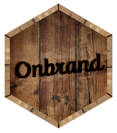
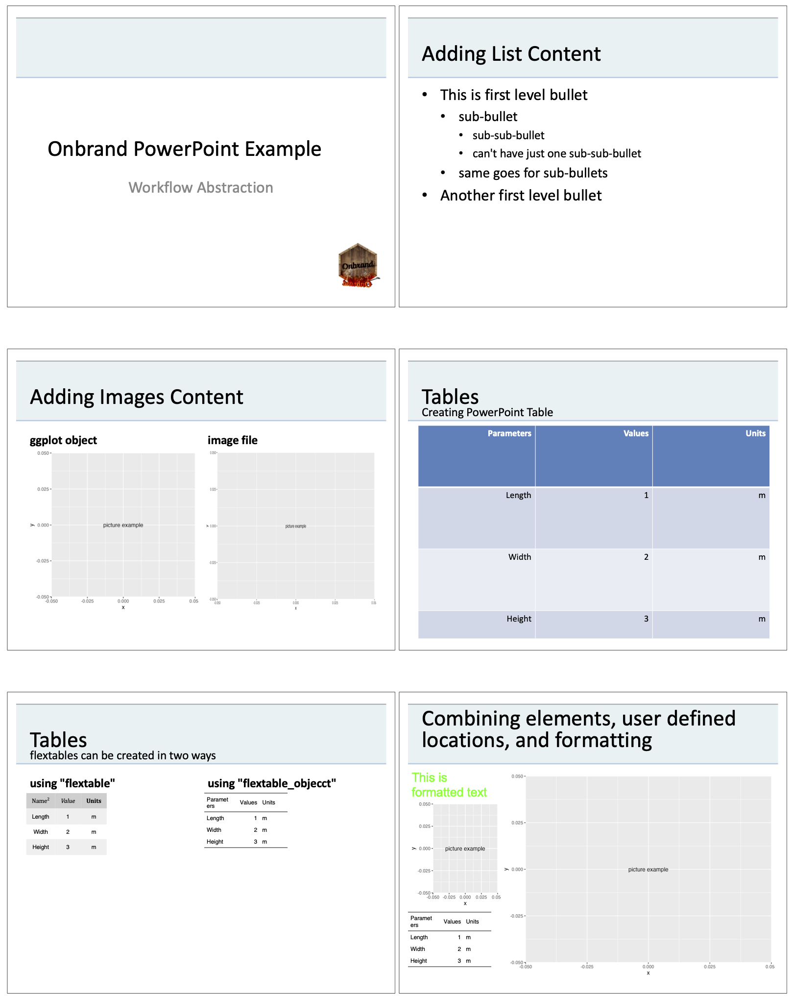
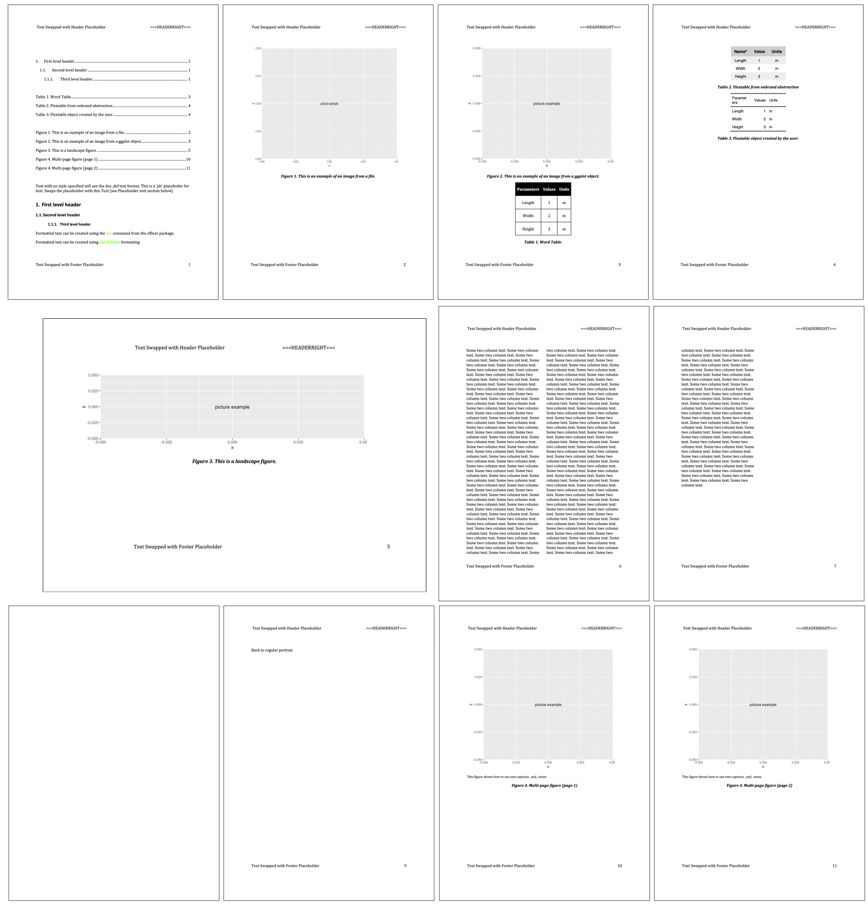

```{r setup, include=FALSE}
knitr::opts_chunk$set(echo = TRUE)
library(onbrand)
library(officer)
library(magrittr)
library(flextable)

ex_yaml = "rpptx:
  master: Office Theme
  templates:
    title_slide:
      title:
        ph_label:     Title 1
        content_type: text
      sub_title:
        ph_label:     Subtitle 2
        content_type: text"
ex_yaml_tmpfile =  tempfile(fileext=".yaml")
fileConn<-file(ex_yaml_tmpfile)
writeLines(ex_yaml, fileConn)
close(fileConn)

ex_yaml_read = yaml::read_yaml(ex_yaml_tmpfile)

# if_onbrand_hex_png           = system.file(package="onbrand","figures","onbrand_hex.png")
# if_ppt_workflow_output_png   = system.file(package="onbrand","figures","ppt_workflow_output.png")
# if_doc_workflow_output_png   = system.file(package="onbrand","figures","doc_workflow_output.png")
# b64_onbrand_hex_png          = knitrdata::data_encode(if_onbrand_hex_png         , encoding="base64")
# b64_ppt_workflow_output_png  = knitrdata::data_encode(if_ppt_workflow_output_png , encoding="base64")
# b64_doc_workflow_output_png  = knitrdata::data_encode(if_doc_workflow_output_png , encoding="base64")
```

# Introduction 

The `officer` package is used to generate all of the underlying PowerPoint and Word documents. The purpose of `onbrand` is to provide an abstraction layer (or mapping) for the functions in `officer` in order to allow the same reporting workflow to be used with different template documents. This involves providing a consistent customizable method to interact with templates as well as a form of markdown to control the formatting of text. 

If you want to use your own Office templates, we recommend you see the _Custom Office Templates Vignette_. This vignette focuses on how to construct workflows using templates. Here we will use the internal templates embedded in `onbrand`. If you want to copy them locally you can use the following commands:

``` r
file.copy(system.file(package="onbrand", "templates", "report.pptx"), "report.pptx")
file.copy(system.file(package="onbrand", "templates", "report.docx"), "report.docx")
file.copy(system.file(package="onbrand", "templates", "report.yaml"), "report.yaml")
```
## PowerPoint

### Loading your presentation template

To create a new `onbrand` object for a PowerPoint document you need to use `onbrand::read_template()`. This requires that you supply the path to your PowerPoint document and the `yaml` mapping files as follows:
```{r}
obnd = read_template(
       template = file.path(system.file(package="onbrand"), "templates", "report.pptx"),
       mapping  = file.path(system.file(package="onbrand"), "templates", "report.yaml"))
```

### Adding content

The mapping file (printed at the bottom of this document) uses descriptive names for slide masters and placeholders. Here is a snippet from our report `yaml`.
```{r echo=FALSE, comment='', message=TRUE, eval=TRUE}
cat(readLines(ex_yaml_tmpfile) , sep="\n")
```

To add content, use `onbrand::report_add_slide()`. The following will add a slide using the templated `title_slide` layout. Provide the `elements` argument with a list of placeholder names - each containing a list of values for both `content` and `type`. For each placeholder name listed you need to specify the content and the type of content in its own list: 

```{r}
obnd = report_add_slide(obnd,
  template = "title_slide",
  elements = list(
     title     = list( content = "Onbrand PowerPoint Example",
                       type    = "text"),
     sub_title = list( content = "Workflow Abstraction",
                       type    = "text")))
```

For a detailed description of the different types of content and the expected format see the help for the `onbrand::add_pptx_ph_content()` function. Briefly, you can specify the following content types:

- `"text"` - a string of text (only possible when the type in the mapping file is _text_)
- `"list"` - list of information (only possible when the type in the mapping file is _list_)
- `"imagefile"` - string containing the path to an image file 
- `"ggplot"` -  a ggplot object
- `"table"` - list containing table content and other options
- `"flextable"` - list containing flextable content and other options
- `"flextable_object"` - user-defined flextable object


#### Lists

The previous example showed how to add text content.  To add a list, define a vector with paired content of the format `c("indent level", "content", "indent level", "content)`. Where `indent level` indicates a numeric value starting at 1. For example, we could define the following list content:

```{r}
bl = c("1", "This is first level bullet",
       "2", "sub-bullet",
       "3", "sub-sub-bullet",
       "3", "can't have just one sub-sub-bullet",
       "2", "same goes for sub-bullets",
       "1", "Another first level bullet")
```

The list `bl` can then be added to the _content_ value of any placeholder with `list` as the type in the mapping file:

```{r}
obnd = report_add_slide(obnd,
  template = "content_list",
  elements = list(
     title        = list( content = "Adding List Content",
                          type    = "text"),
     content_body = list( content = bl,
                          type    = "list")))
```

#### Figures

Figures can be added in two ways:  

1. as an image file (e.g. a png)   
2. as a ggplot object (_preferred method_)   

Generally, the ggplot object is preferred as it will automatically size according to the dimensions of the placeholder. First lets create some images:

```{r}
library(ggplot2)
p = ggplot() + annotate("text", x=0, y=0, label = "picture example")
imgfile = tempfile(pattern="image", fileext=".png")
ggsave(filename=imgfile, plot=p, height=5.15, width=9, units="in")
```

Now that the object `p` contains the ggplot object and `imgfile` points to a png file containing that image, we can add the content to our `two_content_header_text` slide template: 

```{r}
obnd = report_add_slide(obnd,
  template = "two_content_header_text",
  elements = list(
     title                = list(content  = "Adding Images Content",
                                 type     = "text"),
     content_left_header  = list(content  ="ggplot object",
                                 type     = "text"),
     content_left         = list(content  = p,
                                 type     = "ggplot"),
     content_right_header = list(content  ="image file",
                                 type     = "text"),
     content_right        = list(content  = imgfile,
                                 type     = "imagefile")))
```

#### Tables

Tables can be supplied in three different ways, each providing increasing level of control over the output:

- `table` - Expects a list with the tabular data and other attributes. It uses the underlying tables in PowerPoint to make the tables. 
- `flextable` - Expects a list similar to the `table` above, but instead of using the PowerPoint tables, the table is created using the `flextable` package.
- `flextable_object` - This allows you to create a flextable on your own and use it directly. The ultimate level of control.

Lets start by creating a simple data frame:

```{r}
tdf = data.frame(Parameters = c("Length", "Width", "Height"),
                 Values     = 1:3,
                 Units      = c("m", "m", "m") )
```

To create a PowerPoint table, use the `table` content type.  Construct a named list with a single element, `table`,  containing the data frame; `tab_cont = list(table = tdf)`. You can add list elements to display header information as well. See the help for `onbrand::add_pptx_ph_content()` for details.

```{r}
tab_cont = list(table = tdf)
obnd = report_add_slide(obnd,
  template = "content_text", 
  elements = list(
     title         = list( content      = "Tables",
                           type         = "text"),
     sub_title     = list( content      = "Creating PowerPoint Table",
                           type         = "text"),
     content_body  = list( content      = tab_cont,
                           type         = "table")))
```

Sometimes you may want to have a little more control over the tabular output. The `flextable` type allows you to supply the data and information about the flextable to be created and `onbrand` will then use them to create the flextable for you. 

```{r}
tab_ft = list(table         = tdf,
              header_format = "md",
              header_top    = list(Parameters = "Name^2^",
                                   Values     = "*Value*",
                                   Units      = "**Units**"),
              cwidth        = 0.8,
              table_autofit = TRUE,
              table_theme   = "theme_zebra")
```

Here we are specifying that we want the header format of the table to be rendered as markdown `"md"` and we are specifying that the top header (there can be top, middle and bottom) should be overwritten (for more on formatting with markdown see the markdown section below). Next we specify some other details like the column width. Again reference the help for `onbrand::add_pptx_ph_content()`.  It covers the details of the list elements that can be supplied.

Alternatively, you can create a flextable object directly using the `flextable` package. There is an enormous amount of flexibility in the `flextable` package. Some of these can be seen in the Word examples below, but you should see the documentation for that package to get a feel for what is possible.  

```{r}
tab_fto = flextable(tdf)                      
```

You can then add these (flextable list: `tab_ft`, flextable object: `tab_fto`) to any of the placeholders on a slide:

```{r}
obnd = report_add_slide(obnd,
  template = "two_content_header_text",
  elements = list(
     title                 = list( content      = "Tables",
                                   type         = "text"),
     sub_title             = list( content      = "flextables can be created in two ways",
                                   type         = "text"),
     content_left_header   = list( content      = 'using "flextable"',
                                   type         = "text"),
     content_left          = list( content      = tab_ft,
                                   type         = "flextable"),
     content_right_header  = list( content      = 'using "flextable_objecct"',
                                   type         = "text"),
     content_right         = list( content      = tab_fto,
                                   type         = "flextable_object")))
```

### Saving presentations 

Once you are done adding content you can save the presentation to a file:

``` r
save_report(obnd, "vignette_presentation.pptx")
```
```{r, eval=FALSE, echo=FALSE}
save_report(obnd, tempfile(fileext=".pptx")
```

Which should look something like this:
{width=600px} 

### Accessing the PowerPoint mapping information

Sometimes it can be difficult to remember the template and placeholder names from the mapping file. You and use the `onbrand::template_details` function to show this information for the current `onbrand` object.

```{r, message=TRUE}
details = template_details(obnd) 
```


If you do not want to use the interfaces above for creating slides but would like to use the named mapping information in a more traditional `officer` workflow you can use the function `fph`. After you've loaded the `onbrand` object above (`obnd`) you can then pull out the placeholder label from PowerPoint for any named placeholder in a template layout specified in the yaml mapping file. For example if we wanted the placeholder label for the `content_left_header` in the `two_content_header_text` layout we would use the following:

```{r}
ph = fph(obnd, "two_content_header_text", "content_left_header")$pl
```

## Word

### Loading your Word template

The `onbrand::read_template()` function is also used to create a new `onbrand` object for a Word report. Just as before, you need to supply the path to your Word template and the mapping file. This example points to files within the `onbrand` package:


```{r}
obnd = read_template(
  template = file.path(system.file(package="onbrand"), "templates", "report.docx"),
  mapping  = file.path(system.file(package="onbrand"), "templates", "report.yaml"))
```

### Adding content

Word report content is added using the `onbrand::report_add_doc_content()` function. This expects the user to identify the `type` of content being supplied. At a high level the following types of content can be added:

- `"break"` - page break
- `"toc"` - table of contents
- `"ph"` - text content to substitute for placeholders in the document
- `"text"` - text supplied as either character string, markdown or the result of `officer::fpar()` statements
- `"imagefile"` - string containing the path to an image file 
- `"ggplot"` -  a ggplot object
- `"table"` - list containing table content and other options
- `"flextable"` - list containing flextable content and other options
- `"flextable_object"` - user-defined flextable object

Similar to adding PowerPoint content, you must also supply a list containing the content and information about the content. Examples of each of these will be provided in the sections below. However you should see the help for  `onbrand::report_add_doc_content()` to get a detailed explanation of the format of `content`.  

### Table of contents

A table of contents, list of figures, or list of tables is added using the content type `"toc"`. You can supply a level and/or an `onbrand` style. If you supply a level, the TOC will be generated down to that header level. If you supply an `onbrand` style, the TOC will include each element with that style. So if you wish to generate separate lists of tables and figures it is important that your `onbrand` styles for those point to different Word styles.

This will add a typical TOC:

```{r}
obnd = report_add_doc_content(obnd,
  type     = "toc",
  content  = list(level=3))
```

While this should add the list of tables:

```{r}
obnd = report_add_doc_content(obnd,
  type     = "toc",
  content  = list(style="Table_Caption"))
```

And this should add a list of figures:

```{r}
obnd = report_add_doc_content(obnd,
  type     = "toc",
  content  = list(style="Figure_Caption"))
```

**Note:** If you try to update the TOCs and you get the following:

**No table of contents entries found.**

You may need to change the separator option in the `yaml` mapping file from: `,` to `;`.

### Text

The content type `"text"` is the most straight forward way to add content to a Word document, and the `content` is a list that has three possible elements. The only one required is the `text` element. If you just want to add text in the default format (`doc_def` in the `yaml` mapping file), then this is all you need to do:

```{r}
obnd = report_add_doc_content(obnd,
  type     = "text",
  content  = list(text="Text with no style specified will use the doc_def text format. This is a 'ph' placehoder for text: ===BODY-TEXT-EXAMPLE=== [see Placeholder text section below]"))
```

#### Styles

Alternatively you can specify any style defined in the `yaml` mapping file by adding a `style` element to the content list. This shows how to create multi-level headers:

```{r}
obnd = report_add_doc_content(obnd,
  type     = "text",
  content  = list(text  ="First level header",
                  style = "Heading_1"))
obnd = report_add_doc_content(obnd,
  type     = "text",
  content  = list(text  ="Second level header",
                  style = "Heading_2"))
obnd = report_add_doc_content(obnd,
  type     = "text",
  content  = list(text  ="Third level header",
                  style = "Heading_3"))
```

**Note:** If you want to use table and figure caption numbers that use section numbers (e.g. 1-1, 1-2, etc.) you may want/need to reset the figure counter for each major section. To do this you will need to use the `fig_start_at` and `tab_start_at` arguments to reset the counters for that section. 

#### Formats

The other element you may want to control is the format of the content. In the previous examples you just needed to provide character data, but there are three possible formats you can use:

- `"text"` - character string (previous examples)
- `"md"` - character string with markdown to be rendered (see the section on markdown below)
- `"fpar"` - `officer::fpar()` object from `officer` (used with paragraph text)
- `"ftext"` - list of `officer::ftext()` objects  `officer` (used with captions and notes for figures and tables)

The following provide example `"fpar"` and `"md"` formats

```{r}
library(officer)

fpartext = fpar(
ftext("Formatted text can be created using the ", prop=NULL),
ftext("fpar ", prop=fp_text(color="green")),
ftext("command from the officer package.", prop=NULL))

obnd = report_add_doc_content(obnd,
  type     = "text",
  content  = list(text   = fpartext, 
                  format = "fpar",
                  style  = "Normal"))

mdtext = "Formatted text can be created using **<color:green>markdown</color>** formatting"
obnd = report_add_doc_content(obnd,
  type     = "text",
  content  = list(text   = mdtext,
                  format = "md",
                  style  = "Normal"))

```

### Figures

Similar to the PowerPoint example above we're going to create some figures. Both an image file (`imgfile`) and a ggplot object (`p`):
```{r}
p = ggplot() + annotate("text", x=0, y=0, label = "picture example")
imgfile = tempfile(pattern="image", fileext=".png")
ggsave(filename=imgfile, plot=p, height=5.15, width=9, units="in")
```

We can add these by specifying the appropriate content type. The content list can contain different information. Typically you would either specify the image file or ggplot object as well as a caption:

```{r}
obnd = report_add_doc_content(obnd,
  type     = "imagefile",
  content  = list(image   = imgfile,
                  caption = "This is an example of an image from a file."))
```

```{r}
obnd = report_add_doc_content(obnd,
  type     = "ggplot",
  content  = list(image   = p,
                  caption = "This is an example of an image from a ggplot object."))
```

### Tables

Tables in Word are similar to the tables in PowerPoint. The table type can be either `table`, `flextable`, or `flextable_object`. Lets look at this data frame to see how to use each of these:
```{r}
tdf =    data.frame(Parameters = c("Length", "Width", "Height"),
                    Values     = 1:3,
                    Units      = c("m", "m", "m") )
```

To insert a native Word table, you would use the `table` type and the content is just a list with an element named `table` that has the value of a dataframe. As with figures, the content list can have an optional caption as well. 

```{r}
tab_cont = list(table   = tdf,
                caption = "Word Table.")
obnd = report_add_doc_content(obnd,
  type     = "table",
  content  = tab_cont)
```

Flextables can be used with the `flextable` type and information like headers, header formatting, etc can be passed along. `onbrand` will then construct the flextable for you. 

```{r}
tab_ft = list(table         = tdf,
              header_format = "md",
              header_top    = list(Parameters = "Name^2^",
                                   Values     = "*Value*",
                                   Units      = "**Units**"),
              cwidth        = 0.8,
              table_autofit = TRUE,
              caption       = "Flextable from onbrand abstraction",
              table_theme   = "theme_zebra")
obnd = report_add_doc_content(obnd,
  type     = "flextable",
  content  = tab_ft)   
```

Lastly, to have the most control over the table you can construct a flextable yourself and pass that along in the content.

```{r}
tab_fto = flextable(tdf)                      
obnd = report_add_doc_content(obnd,
  type     = "flextable_object",
  content  = list(ft=tab_fto,
                  caption  = "Flextable object created by the user."))
```

### Formatting sections

Section formatting, changing the page orientation and/or the number of columns, is controlled using the `"section"` content type. It may seem a bit counter intuitive but sections apply to the content added **since the last** section type specification. So now lets try the following:

- Add a landscape figure
- Add two column text   
- Add more content in portrait orientation

To change formatting we need to close out the current section by inserting a portrait section type: 

```{r}
obnd = report_add_doc_content(obnd,
     type     = "section",
     content  = list(section_type  ="portrait"))
```

Then we add the content we want in landscape mode:

```{r}
obnd = report_add_doc_content(obnd,
  type     = "ggplot",
  content  = list(image   = p,
                  height  = 2.5,
                  width   = 9,
                  caption = "This is a landscape figure."))
```

Now we tell the underlying report to apply landscape formatting to everything that has been added since the portrait section type:

```{r}

obnd = report_add_doc_content(obnd,
  type     = "section",
  content  = list(section_type  ="landscape",
                  height        = 8,
                  width         = 10))
 
```

Now we want to add the text for the two column format:

```{r}
obnd = report_add_doc_content(obnd,
  type     = "text",
  content  = list(text    = paste(rep("Some two column text.", 200), collapse=" ")))

```

Now we insert a section indicating that we want to change the section to multiple columns. The number of columns is inferred from the number of elements in the `widths` argument:

```{r}
obnd = report_add_doc_content(obnd,
  type     = "section",
  content  = list(section_type  ="columns",
                  widths        = c(3,3)))

```

We can now add content but don't forget to set the insert a portrait section at the end just before you save the document.

```{r}
obnd = report_add_doc_content(obnd,
  type          = "text",
  content       = list(text    = "Back to regular portrait"))
```

### Placeholder text

When generating reporting workflows it can be helpful to have placeholder text in the report that is populated based on the specifics of that report. To add placeholders you can use the `"ph"` content type. This content type will not appear in the `yaml` file, it is unique to `onbrand`.  A placeholder is a unique string of text surrounded on both sides by `===` (_three equal signs_). If the placeholder is in your template document, it may not work correctly if you type the text into Word. This is because while a string may appear to be a contiguous in Word, it may not be so in the underlying XML code. To ensure the string is contiguous you should type the placeholder text into a text editor, then copy and paste it into the Word template. 

The placeholder can be in the document template itself (in the footer or header sections) or in the text you generate and add as part of your workflow. In this example, the text `===BODY-TEXT-EXAMPLE===` was added into the text content we added in the first step above. That placeholder will be replaced with the text `Swaps the placeholder with this Text`. 


```{r}
obnd = report_add_doc_content(obnd,
  type     = "ph",
  content  = list(name     = "BODY-TEXT-EXAMPLE",
                  value    = "Swaps the placeholder with this Text",
                  location = "body"))
```

You can have the placeholders in the body as in the previous example and also in the headers and footers of the document. Again, these will not appear in the `yaml` mapping (or abstraction layer).  In these examples the `===FOOTERLEFT===` and `===HEADERLEFT===` placeholders are found in the template itself.  There is another placeholder `===HEADERRIGHT===` which we have not used so that you can see it in the final output.  

```{r}
obnd = report_add_doc_content(obnd,
  type     = "ph",
  content  = list(name     = "FOOTERLEFT",
                  value    = "Text Swapped with Footer Placeholder",
                  location = "footer"))
obnd = report_add_doc_content(obnd,
  type     = "ph",
  content  = list(name     = "HEADERLEFT",
                  value    = "Text Swapped with Header Placeholder",
                  location = "header"))
```

Headers are applied when the document is saved and can be added at any time to the `onbrand` report object.

### Formatting sections (again)

Recall up above that we were in a multi-column page format, but we wanted to return to the default portrait single column format. We added text but before we save the file we need to tell the document to apply the new section type:

```{r}
obnd = report_add_doc_content(obnd,
  type     = "section",
  content  = list(section_type  ="portrait"))
```

**Note:** that if you don't alter the page format/layout from the document default, then you do not need to add any section content.

### Multi-page figures and tables

Some figures and tables need to span multiple pages. If you have a large `flextable` it will do that automatically. However it may be more desirable to have a caption on each page with the figure or table. To accomplish this, using a figure as an example you need to create a separate figure for each page. For each figure you will need to provide the *same* key value. The first figure with that key will be assigned a figure number and the other figures with that key will have the same number that references the first. 

```{r}
obnd = report_add_doc_content(obnd,
  type     = "ggplot",
  content  = list(image           = p,
                  notes_format    = "text",
                  key             = "ex_fig_text",
                  notes           = "This figure shows how to use text captions _and_ notes",
                  caption_format  = "text",
                  caption         = "Multi-page figure (page 1)"))

obnd = report_add_doc_content(obnd,
  type     = "break",
  content  = NULL)

obnd = report_add_doc_content(obnd,
  type     = "ggplot",
  content  = list(image           = p,
                  notes_format    = "text",
                  key             = "ex_fig_text",
                  notes           = "This figure shows how to use text captions _and_ notes",
                  caption_format  = "text",
                  caption         = "Multi-page figure (page 2)"))
```

### Cross referencing figures and tables

When figures and tables are created above each content list has an optional key. In the example from the last section we created the key `"ex_fig_text"`. To reference in the word document you have two options. You can construct your content using onbrand markdown. Then you simply need to use the `ref` tag: `<ref:ex_fig_text>` and the figure number will be replaced when the document is built. You can also use the `officer::fpar()` function to construct content. Then you would use the officer command `officer::run_reference()` and the figure key to insert the figure number. 

### Saving the Word report 

Once you are done adding content you can save the report to a file with the `save_report()`` function as well:

``` r
save_report(obnd, "vignette_report.docx")
```

```{r, eval=FALSE, echo=FALSE}
of = tempfile(fileext=".docx")
save_report(obnd, of)
```

The output from the example above should look like this:

{width=700px}

### Accessing the Word mapping information

It can also be useful to quickly access the `onbrand` style names. You can use the same `onbrand::template_details` function to display the current styles available to you:

```{r, message=TRUE}
details = template_details(obnd) 
```

As with the PowerPoint interface, you can also access the named Word mapping directly. This is done through the `fst` function. With the `onbrand` objected loaded (`obnd`) you can supply an `onbrand` style name and pull out the Word style name (`wsn`) and the default font format (`dff`):

```{r}
st = fst(obnd, "Heading_3")
#Word style name
wsn = st$wsn
# Default font format
dff = st$dff
```

## Formatting with markdown

In `officer` you can change formatting in text using `fpar` and `as_pargraph`. There are situations where this is less than ideal. For example if you want to take formatted user input from a Shiny app, it may not be practical to have them supply code this way. 

To make formatting a little easier, `onbrand` provides the ability to use markdown. This can be seen above in flextable objects for PowerPoint content and with text, captions in Word. For a list of allowed markdown formatting see the help for `onbrand::md_to_officer()``. 

If you want to use the markdown functionality outside of `onbrand` you can use the two functions:

- `onbrand::md_to_officer` - This function will take the markdown text and convert that into strings of text containing officer commands in `fpar` and `as_paragraph` commands. You simply need to use the `eval` command to execute them.
- `onbrand::md_to_oo` - A function that wraps around `md_to_officer` and returns the `as_paragraph` result.

### Using `onbrand::md_to_oo` to format 

First lets start with data. Here we have dimensional data listed as a mean and variance:

```{r}
data = data.frame(property = c("mean",   "variance"),
                  length     = c(200,      0.13),
                  width      = c(12,       0.05),
                  area       = c(240,      0.11),
                  volume     = c(1200,     0.32))

```

Now lets create a flextable object with a header that shows the property being reported on one line and the units on the line below:

```{r}
header = list(property = c("",             ""),
              length   = c("Length",       "cm"),
              width    = c("Wdith",        "cm"),
              area     = c("Area",         "cm2"),
              volume   = c("Volume",       "cm3"))

ft = flextable::flextable(data)                     %>% 
     flextable::delete_part(part = "header")        %>%
     flextable::add_header(values =as.list(header)) %>%
     flextable::theme_zebra()
```

That flextable currently looks like this:

```{r echo=FALSE}
htmltools_value(ft)
```

Now, lets customize some things. For example, suppose we want to use exponents on the units and represent the mean and variance with $\mu$ and $\sigma^2$. 

First, we need to create lists with the default value for the table labels (i.e. the header) and the table body. The markdown will create deviations from these defaults. You can look at the help for `onbrand::md_to_oo` to get the appropriate list format. Here we're just pulling them out of the `onbrand` object using `onbrand::fetch_md_def()`.

```{r}
dft      = fetch_md_def(obnd, style="Table_Labels")$md_def
dft_body = fetch_md_def(obnd, style="Table")$md_def
```

Now we can use the `flextable::compose` function to walk through the table and overwrite the defaults that were set when the flextable was created:

```{r}
ft = ft %>%
  flextable::compose(j     = "area",
          part  = "header", 
          value = c(md_to_oo("Area", dft)$oo, md_to_oo("cm^2^", dft)$oo))   %>%
  flextable::compose(j     = "volume", 
          part  = "header",
          value = c(md_to_oo("Volume", dft)$oo, md_to_oo("cm^3^", dft)$oo)) %>%
  flextable::compose(j     = "property", 
          i     = match("mean", data$property),                        
          part  = "body",  
          value = c(md_to_oo("**<ff:symbol>m</ff>**", dft_body)$oo))    %>%
  flextable::compose(j     = "property",
          i     = match("variance", data$property), 
          part  = "body",                                                     
          value = c(md_to_oo("**<ff:symbol>s</ff>**^**2**^", dft_body)$oo))
```

Now the flextable object looks like this:

```{r echo=FALSE}
htmltools_value(ft)
```

**Note that the Greek symbols are not rendered correctly here but will be rendered correctly in the document.**

To include the newly formatted table in the `onbrand` object, you use the same method as before:

```{r}
obnd = report_add_doc_content(obnd,
  type     = "flextable_object",
  content  = list(ft=tab_fto,
                  caption  = "Flextable object with custom Markdown - created by the user."))
```

## Accessing the `officer` object directly

Sometimes you need more control over creating a report, and you may want to use the officer commands directly. To do this you can use the function `fetch_officer_object()` to pull out the officer object from the `onbrand` object:

```{r echo=FALSE}
rpt = fetch_officer_object(obnd)$rpt
```

Now you can use any officer command you wish on the `rpt` object. And when you're done you can put the object back into the `onbrand` object using `set_officer_object()`:

```{r echo=FALSE}
obnd = set_officer_object(obnd, rpt)
```

## Mapping file
```{r echo=FALSE, comment='', message=TRUE, eval=TRUE}
cat(readLines(file.path(system.file(package="onbrand"), "templates", "report.yaml")) , sep="\n")
```
