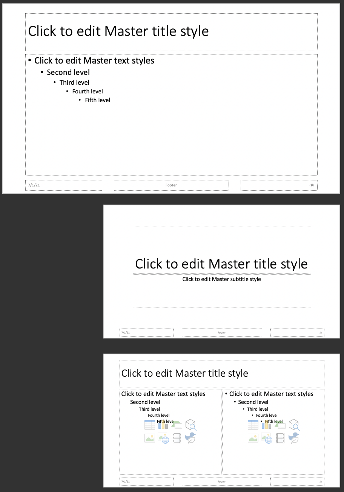
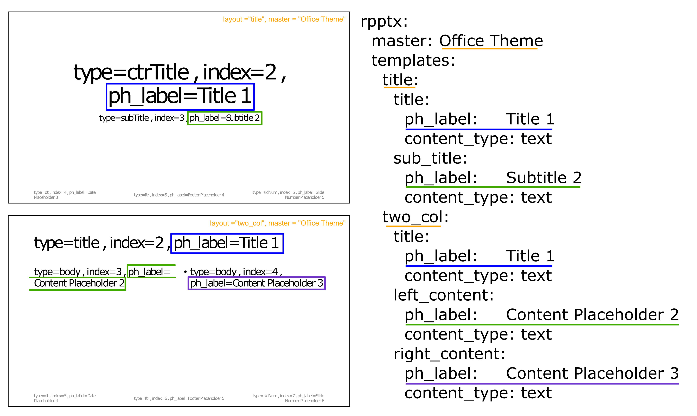
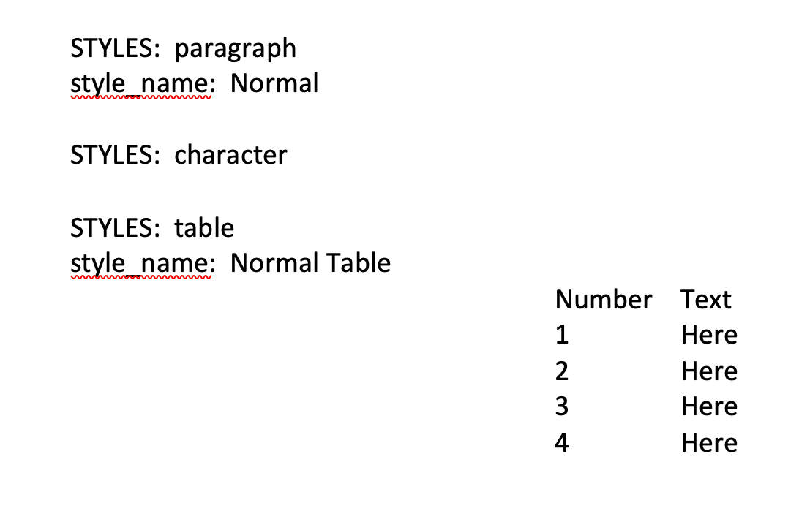

```{r setup, include=FALSE}
knitr::opts_chunk$set(echo = TRUE)


# Colors used in graphics to describe different elements
c_orange = "ffa500ff"
c_green  = "44aa00ff"
c_blue   = "0000ffff"
c_purple = "7137c8ff"

ex_yaml = "tree colors:
  roots:
    - white 
    - brown
  trunk:
    bark: brown
  crown:
    branches:
      leaves:  green
      flowers: red"
ex_yaml_tmpfile =  tempfile(fileext=".yaml")
fileConn<-file(ex_yaml_tmpfile)
writeLines(ex_yaml, fileConn)
close(fileConn)

ex_yaml_read = yaml::read_yaml(ex_yaml_tmpfile)

# if_onbrand_hex_png                  = system.file(package="onbrand","figures","onbrand_hex.png")
# if_example_layout_ppt_master_png    = system.file(package="onbrand","figures","example_layout_ppt_master.png")
# if_example_layout_yaml_pptx_png     = system.file(package="onbrand","figures","example_layout_yaml_pptx.png")
# if_example_layout_docx_png          = system.file(package="onbrand","figures","example_layout_docx.png")
# b64_onbrand_hex_png                 = knitrdata::data_encode(if_onbrand_hex_png               , encoding="base64")
# b64_example_layout_ppt_master_png   = knitrdata::data_encode(if_example_layout_ppt_master_png , encoding="base64")
# b64_example_layout_yaml_pptx_png    = knitrdata::data_encode(if_example_layout_yaml_pptx_png  , encoding="base64")
# b64_example_layout_docx_png         = knitrdata::data_encode(if_example_layout_docx_png       , encoding="base64")
```

# Introduction

The main purpose of `onbrand` is to create an abstraction layer that allows for the same reporting workflow to be used with different document templates. In order to do this, the abstraction information (or mapping) needs to be provided in a `yaml` configuration file. The process will be detailed below, but at a high level it involves the following steps:

1. Read in a template using the function: `onbrand::view_layout()`  
2. Use the resulting files to create the mapping (saved as a `.yaml`)
3. Test the mapping for accuracy using the function: `onbrand::preview_template()`

The following sections describe this process in detail for both Word and PowerPoint documents. Before you get started, copy the provided examples into your current working directory.  To do so, use the following code:

```{r, eval=FALSE}
library(onbrand)
file.copy(system.file(package="onbrand","examples","example.pptx"), ".", overwrite = TRUE)
file.copy(system.file(package="onbrand","examples","example.docx"), ".", overwrite = TRUE)
file.copy(system.file(package="onbrand","examples","example.yaml"), ".", overwrite = TRUE)
```

This will create the following files:

- `example.pptx` - example PowerPoint template
- `example.docx` - example Word template
- `example.yaml` - example `yaml` mapping file (shown at the bottom)

### Mapping and the `yaml` file format

Before we start discussing how to create templates we need to talk a little bit about the `yaml` file format (and it's recursive nature). If you already understand this, feel free to skip ahead to the relevant section below. 

`onbrand` utilizes the `yaml` file as a method for describing information in a hierarchical manner using key/value pairs. To help understand this better, consider the following example where the colors of the different parts a tree are listed in a hierarchy based on where the parts are located on the tree:

```{r echo=FALSE, comment='', message=TRUE, eval=TRUE}
cat(readLines(ex_yaml_tmpfile) , sep="\n")
```

This example lays out `key: value` pairs based on the formatting of the file. The key is followed by both a colon and a space (`: `) which are, in turn, followed by the value.  

- If you have multiple values you can list those below the key (see below about spacing).  
- If the value also has a colon then it's a key for a nested value. 

The main key in the example above is `tree colors`.  This key has three values: `roots`, `trunk`, and `crown`. One for each section of a tree.  The hierarchy comes from the indentation. Each of the main sections of a tree are indented two spaces.  Each of these values (`roots`, `trunk`, and `crown`) are also keys themselves because they end with both a colon and a space - and are followed by still more values.

The color values associated with roots are `white` and `brown`. The `root` hierarchy is complete.  

The `trunk` has value `bark`.  But, because `bark` is also indented two spaces and is followed by both a colon and a space, it is also a key with value `brown`. Which completes the `trunk` hierarchy.

The value `crown` is indented two spaces and followed by both a colon and a space.  Hence, `crown` is a key with value `branches`.  Again, `branches` is indented and followed by both a colon and a space.  Then, `branches` is also a key with values: `leaves` and `flowers`.  Each of these are also indented and followed by by both a colon and a space.  So the key `leaves` has value `green`. Similarly, key `flowers` has value `red`.  This completes the `crown` hierarchy. 

There is more that can go into a `yaml` file, but this should be enough to help you understand how to create mapping files for `onbrand`.  For more details see [yaml.org](http://yaml.org).

## PowerPoint

This section provides a detailed walk-through for each of the three steps in the Introduction.  We recommend everyone walk through this process at least once.  

A quick note about terminology.  A slide master is the top slide in a hierarchy of slides that stores information about the theme and slide layouts of a presentation, including the background, color, fonts, effects, placeholder sizes, and positioning. The slide master is the largest slide image at the top of the slide thumbnail list.

{width=400px}

### Step 1: Read the PowerPoint template  

To create your custom abstraction layer for PowerPoint, you start by reading in your master template.  If you don't already have one, create a PowerPoint template master slide with slide layouts for each of the different layouts you want to use. In this example, we have the `Office Theme` Master Slide with two slide layouts:

1. a title slide named: `title`
2. a content slide with two columns of information named: `two_col`

**Tip** When you make slide layouts under a master, give each of them a descriptive name that will be easy to use when you are coding later. These names will be used to refer to them within scripts. 

PowerPoint assigns read-only names to every placeholder within each slide layout. To reveal those read-only names, create an annotated slide deck using the `onbrand::view_layout()` function:

```{r eval=FALSE}
library(onbrand)
vlres = view_layout(template    = "example.pptx", 
                    output_file = "example_layout.pptx")
```

This will create the file `example_layout.pptx`. It contains a slide for each slide layout (`title` & `two_col`) under the master (`Office Theme`) in the input template file (`example.pptx`). On each slide, the names of both the slide layout and slide master will be indicated in the upper right corner. Each placeholder within the slide layout will be shown and is identified by the placeholder label (`ph_label`).  For each placeholder within each slide layout under a slide master, `onbrand::view_layout()` produces three pieces of information: `ph_label`, `type`, and `index`.  Notice, there are plenty of duplicate placeholder names. 

### Step 2: Create the PowerPoint mapping

Before we get to the mapping, take a moment to locate and open the `example.yaml` file we copied over at the start of this vignette. In the yaml file there will be a key for mapping PowerPoint templates (rows 1-39 in the file). This key is called `rpptx` and it will have three values (_which are also keys_):

- `master` - Holds the name of the master slide
- `templates` - Has an element for each slide layout you want to use in the template
- `md_def` - Default formatting for when markdown formatting is being used

Within the hierarchy of `rpptx: templates:` there is a value for each slide layout: `title` and `two_col`.  

> _Remember the tip in Step 1 about names?  The name you provided becomes the key value in the `yaml`.  It's used to reference the placeholders on the slide in your code._ 

Notice, the `example.yaml` doesn't contain all of the placeholders for either slide in the `example_layout.pptx`.  This is because those elements were inherited from the master slide and are not unique to either of the slide layouts.  

In the `yaml`, each placeholder will have two value pairs below it.  For example, the placeholder `sub_title` in slide layout `title` has both `ph_label` and `content_type`.  The `ph_label` maps to the _ph\_label_ from the annotated layout (in the `example_layout.pptx`). The `content_type` should be either `text` or `list` depending on whether the placeholder contains text or list data. 

The figure below shows how the annotated layout relates to the `yaml` mapping file.

{width=600px}

**Note:** You only have to define mapping information for the slide layouts under a master you want to access in R. You can have as many masters defined in the template as you want and only use a subset in R.

### Defining markdown defaults

Now you need to define the defaults for rendering components with markdown (see the Workflow vignette for more information on how this is used). For this you need to create elements in the following hierarchy:
```
rpptx:
  md_def:
    default:      
      color:                 black
      font.size:             12
      bold:                  TRUE
      italic:                FALSE
      underlined:            FALSE
      font.family:           Helvetica
      vertical.align:        baseline
      shading.color:         transparent
    Table_Labels:
      color:                 black
      font.size:             12
      bold:                  TRUE
      italic:                FALSE
      underlined:            FALSE
      font.family:           Helvetica
      vertical.align:        baseline
      shading.color:         transparent
  post_processing:           NULL
```

For PowerPoint templates you need to define the sections: `default` and `Table_Labels`. The `default` is used when rendering general markdown text. The `Table_Labels` is used when markdown is present in table elements like headers. For each of these you need to define the different aspects of fonts. If you're unsure, just leave them with the defaults above. 

### Post-processing 
```
rpptx:
  post_processing:           NULL
```

Sometimes you may wish to modify the underlying `officer` object. When you call `save_report()`, just before writing the file, the function will look for the field `post_processing`. Here you can define R code to modify the `officer` object. Within the post-processing environment the officer object `rpt` containing your report will be available. You should modify this object to apply any changes you want made. If the `post_processing` element is missing or has a value of `NULL` the post-processing step will be skipped. 

### Step 3: Testing and previewing your template

In R you can read your template by supplying the template and mapping file names:

```{r eval=FALSE}
 obnd = read_template(template = "example.pptx", 
                      mapping  = "example.yaml")
```

When a template is read, `onbrand` will check for basic errors. Look for messages in the console to help you debug any issues you may have. 

After reading in the template, you can test the template using `onbrand::preview_template()`. **Tip** Save the `obnd` report to a file and view it to make sure the mappings are what you expect.

```{r eval=FALSE}
obnd = preview_template(obnd)
save_report(obnd, "example_preview.pptx")
```

That's it.  You have completed the PowerPoint example and used `onbrand` to create an abstraction layer for use in your own efforts.  Keep in mind, this is a very straightforward example.  Depending on the complexity of the template the annotated slide deck generated using `onbrand::view_layout()` will probably not look nearly as clean.  All of the placeholders will be there; they may not be formatted as nicely.  Expect to have to find the annotations you are interested in using in your mapping.

## Word

This section provides a detailed walk-through for each of the three steps in the Introduction.  Once again, we recommend everyone walk through this process at least once. In fact, we assume you have already worked through the PowerPoint section.  If you have not and don't feel very comfortable with abstraction layers and yaml syntax, then you might want to walk through that section first.

Another quick note about terminology.  All Word documents, even a blank document, start from a template. Where PowerPoint templates are more closely tied to specific slide layouts, Word templates are files that help you design documents.  They contain content and design elements (referred to as _content blocks_ or _styles_) to use as a starting point when creating a document.  All the formatting is complete; you simply add what you want to them.  

### Step 1: Read the Word document  

To create your custom abstraction layer for Word, you start by reading in a Word document saved from the template you are using.  This Word document should have all the styles defined and contain all the placeholders you want to use. In the `example.docx` there is one paragraph style and one table style. 

Placeholder can be used in documents. For example, if you wanted to use this template for reports, and you wanted to have "Report NNNN", where NNNN is the report number, in the right header. Then place a text placeholder, e.g., "Report ===RPTNUM===", in the right header.  This placeholder will be referenced in your code; the _Creating Templated Office Workflows Vignette_ has more details.  

**Note:** Do not type this placeholder text directly into the Word document. Cut and paste the text into the Word document from a text editor.  Word is not a text editor, so while the text string may appear to be contiguous, it may not be so in the underlying XML code. 

To view all of the styles in the document you can use the `onbrand::view_layout()` function here as well:

```{r eval=FALSE}
library(onbrand)
vlres = view_layout(template    = "example.docx", 
                    output_file = "example_layout.docx")
```

This will produce a word document, `example_layout.docx` that looks something like this:

{width=600px}

### Step 2: Create the Word mapping  

For each paragraph, character, and table style, `example_layout.docx` displays the name and what that style looks like. You can use this when you define elements in your `yaml` mapping file. The process is very similar to that in the PowerPoint section above so we will not go into as much detail this time.  

In the `example.yaml` file copied over from earlier, there will be a key for mapping Word templates. That key is called `rdocx` and will have the following values: 

- `styles` - maps user-generated (_keys_) for each content block to their respective Word style_name (_values_)
- `doc_def` - maps the  _keys_ defined in the `styles` section to their default values for the report
- `formatting` - general formatting options for the document
- `md_def` - default formatting for styles when markdown is being used

The following sections will walk you through each of these elements in the `example.yaml` mapping file.

#### `styles`

This section contains `onbrand` to Word mappings as key/value pairs.  The keys represent the name of the content block you want to use in your R code.  The values, generated by `onbrand::view_layout()` and found in `example_layout.docx`, represent the style name used by Word. In our example, we have the following styles defined:
```
  styles:
    Plain_Text:               Normal
    Default_Table:            Normal Table
    Table_Caption:            Normal        
    Figure_Caption:           Normal
    Notes:                    Normal
```

So, for example, the `Normal` style is defined in Word, but I'm going to call it `Plain_Text` in the workflows I develop. **Note:** The functions of `onbrand` require you define at least two styles: one paragraph style and one table style.

#### `doc_def`

This section contains the default style mappings as key/value pairs. The keys are required by `onbrand`, so you have to have an entry for each of them. The values are the user-generated (_keys_) from the `styles` section. So, in this example if you want to insert a Word table (`Table`) in the document you are going to generate, the table will be formatted according to the `onbrand` style name `Default_Table`.

```
  doc_def:                     
    Text:                     Plain_Text 
    Table:                    Default_Table 
    Table_Caption:            Table_Caption
    Figure_Caption:           Figure_Caption
    Notes:                    Notes
```

#### `formatting`

Basic document formatting is specified under this key in the `yaml` file. The 
default values are shown here:

```
  formatting:
    separator:                 ","
    Table_Order:
      - table
      - notes
      - caption
    Table_Caption_Label_Pre:   "Table "
    Table_Caption_Label_Post:  ". "
    Figure_Order:
      - figure
      - notes
      - caption
    Figure_Caption_Label_Pre:  "Figure "
    Figure_Caption_Label_Post: ". "
    Figure_Width:              6.0
    Figure_Height:             5.0
    Figure_Seq_Id:             "Figure"
    Figure_Number: |-
      list(officer::run_autonum(pre_label  = "", 
                                seq_id     = Caption_Seq_Id, 
                                post_label = "", 
                                start_at   = Caption_Start_At))
    Table_Seq_Id:              "Table"
    Table_Number: |-
      list(officer::run_autonum(pre_label  = "", 
                                seq_id     = Caption_Seq_Id, 
                                post_label = "", 
                                start_at   = Caption_Start_At))
```

The `separator` key is a region specific setting. From experimentation it seems that in the US and Canada, this should be a comma, and in Europe it should be a semicolon. It mainly appears in the table of contents generation (list of figures or tables). If you try to generate a table of contents and you keep getting  **No table of contents entries found.** try changing the separator from ";" to "," or the reverse.   

The `*_Order` keys indicate the order that the `figure` or `table`, `caption` and `notes` are displayed. The `*_Pre` and `*_Post` elements control what is displayed before (`Pre`) and after (`Post`) the caption number. For example the third table would look like: `Table 3.`. The default figure width and height are specified here in inches. You probably wont need to change the keys ending in `_Seq_Id` and `_Number`. The `*_Seq_Id` specifies the internal Word sequences used to group tables and figures. The `*_Number` keys specify how you want to number things. The default value, while appearing complicated, will just give you a single number. If you want to number your figures with the current section number (e.g. 3-2 for the second figure in the third section) you would do the following:

```
    Figure_Number: |-
      list(
      run_word_field("STYLEREF 1 \\s"),
      ftext("-"),
      officer::run_autonum(pre_label  = "", 
                                seq_id     = Caption_Seq_Id, 
                                post_label = "", 
                                start_at   = Caption_Start_At))
```

**Note:** If you have figures or tables in multiple sections, you will also need to reset the figure counter for each major section that contains figures and tables. To do this you will need to use the `fig_start_at` and `tab_start_at` arguments to `report_add_doc_content()`.

#### `md_def`

These elements contain the default values used when markdown formatting is used. For this section, you will need entries for `default` and `Table_Labels` as well as an entry for each style defined in the `styles` section.  The `default` is used when rendering general markdown text. The `Table_Labels` is used when markdown is present in table elements like headers. 

**Tip** It's a good idea to open up the styles in Word and make sure that each style element (font size, bold, etc) matches what is in your Word document. 

#### `post_processing`

Just like with PowerPoint templates you can define R code to post-process your report as an `officer` object. You need to modify the object `rpt` defined in the post-processing environment. If the `post_processing` element is missing from the yaml file or set to `NULL` it will be ignored. 

### Step 3: Testing and previewing your template

Once you're done creating your abstraction layer (i.e., mapping), you can test the template. In R you can read your template by supplying the template and mapping file names:

```{r eval=FALSE}
obnd = read_template(template = "example.docx", 
                     mapping  = "example.yaml")
```

If there are no problems you can use `onbrand::preview_template()` create an annotated file showing the `onbrand` names mapped to the Word names with the style applied. **Tip** Save the `obnd` report to a file and view it to make sure the mappings are what you expect.

```{r eval=FALSE}
obnd = preview_template(obnd)
save_report(obnd, "example_preview.docx")
```

Once again, that's it.  You have completed the Word example and used `onbrand` to create an abstraction layer for use in your own efforts.  Again, this is a very straightforward example.  Word templates can also become fairly complex, fairly quickly.  Luckily, you only have to do it once per template now!

**Tip** Now that you have walked-through this example, the best way to learn about Word templates is to change something and walk through the steps again. In the example file, we are using the base word document template.  After running through the steps below.  You can add additional _styles_ to the document by opening the styles pane, selecting the appropriate style, and saving (with a new name to easily see the difference).  Similarly, You can also select a new _theme_ and new style set in the design tab. Then rerun `onbrand::view_layout()` and see what's changed.

## Switching templates

The goal of `onbrand` is to allow users to easily switch between organizational document templates without changing the actual reporting workflow. This is accomplished through the `yaml` file (i.e., the abstraction layer). 

First, make a copy of your `yaml` file for the new templates. Then, modify the copy as described below:

### PowerPoint

If you want to change to a new PowerPoint template you need to do the following:

- Under the Master, create slide layouts with the same names
- Create the layouts with the same elements as your previous template
- Use `onbrand::view_layout()` on the new template to get a mapping for the new placeholders
- Edit the new `yaml` file to update the master field, ph_label fields, and the md_def field.
- Confirm the new template is behaving as expected using `onbrand::preview_template()`

**Note**: If you have a template where certain elements are missing you need to set the `ph_label` value to `NULL`. For example  you are changing to a new template that does not have subtitles, but the workflow does have these specified, then for each slide with a subtitle you will need to set that value to `NULL`.

### Word

If you want to change to a new Word template you need to do the following:

- Create a document with the same types of styles in your mapping file
- Use `onbrand::view_layout()` on the new template to get a mapping for the new styles
- Edit the new `yaml` file to update the `styles` section to the new names used in Word (keeping the `onbrand` style names the same)
- Confirm the new template is behaving as expected using `onbrand::preview_template()`

### Using your new template

Once you have a new template and mapping file you can then use those at the top level of your reporting workflow when calling `onbrand::read_template()` and that should be it. To learn more about reporting workflows, walk through the second vignette: _Creating Templated Office Workflows_.

## Mapping file
```{r echo=FALSE, comment='', message=TRUE, eval=TRUE}
cat(readLines(file.path(system.file(package="onbrand"), "examples", "example.yaml")) , sep="\n")
```
